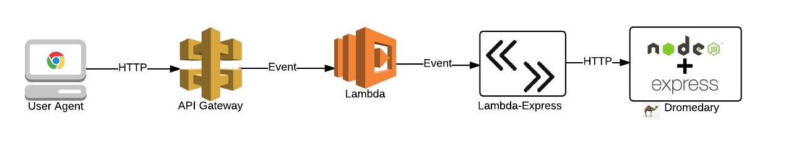

# Lambda Express
[![NPM version][npm-version-image]][npm-url]

[AWS Lambda](https://aws.amazon.com/lambda/) function to integrate with [Express](http://expressjs.com/) from [AWS API Gateway](https://aws.amazon.com/api-gateway/)



Install with `npm install --save lambda-express`

# Express Integration
```
var lambdaExpress = require('lambda-express');
var express       = require('express');
var app           = express();

// ... initialize the app as usual ...


// create a handler function that maps lambda inputs to express
exports.handler = lambdaExpress.appHandler(app);

// or, if you want to do some preprocessing before delegating, pass a function in:
exports.handler = lambdaExpress.appHandler(function(event,context) {
    // ... do some cool stuff here ...

    return app;
});

```

# API Gateway Integration

The request expects the following attributes in the event:

```
    event['queryString'] = 'name=value&foo=bar';        // query string from URL
    event['headers']     = '{key1=val1, key2=val2}';    // string with header values from API Gateway
    event['user-agent']  = '...';                       // string with user agent
    event['source-ip']   = '...';                       // string with source ip for request
    event['api-id']      = '...';                       // id of the api in API Gateway
    event['pathParams']  = '{key1=val1, key2=val2}';    // list of path param values
    event['http-method'] = '...';                       // http request method
    event['resource-path'] = '...';                     // the path for the API Gateway path
```

In API Gateway, this is accomplished with the following integration request mapping template:

```
{
  "stage": "$context.stage",
  "request-id": "$context.requestId",
  "api-id": "$context.apiId",
  "resource-path": "$context.resourcePath",
  "resource-id": "$context.resourceId",
  "http-method": "$context.httpMethod",
  "source-ip": "$context.identity.sourceIp",
  "user-agent": "$context.identity.userAgent",
  "account-id": "$context.identity.accountId",
  "api-key": "$context.identity.apiKey",
  "caller": "$context.identity.caller",
  "user": "$context.identity.user",
  "user-arn": "$context.identity.userArn",
  "queryString": "$input.params().querystring",
  "headers": "$input.params().header",
  "pathParams": "$input.params().path",
  "allParams": "$input.params()"
}
```

On success, the following data structure is returned to Lambda:

```
{
    contentType: '',    // string with Content-Type header from express response
    payload:     ''     // base64 encoded string of the output from express response
}
```

In API Gateway, this is handled with an integration response mapping template of:

```
$util.base64Decode( $input.path('$.payload') )
```

And a header mapping for `Content-Type` of `integration.response.body.contentType`

[npm-url]: https://npmjs.org/package/lambda-express
[npm-version-image]: http://img.shields.io/npm/v/lambda-express.svg?style=flat


If you want more headers on the return request, then add a `responseHeaders` key
to the integration request mapping, separating headers by a `:`.  For example:

```
  ...
  "pathParams": "$input.params().path",
  "allParams": "$input.params()",
  "responseHeaders": "Set-Cookie:X-Custom-Header"
```

Remember, don't forget the `,`.  Then do the same as you did for Content-Type in the
header mapping, e.g. `integration.response.body.Set-Cookie`.
